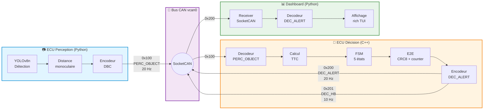
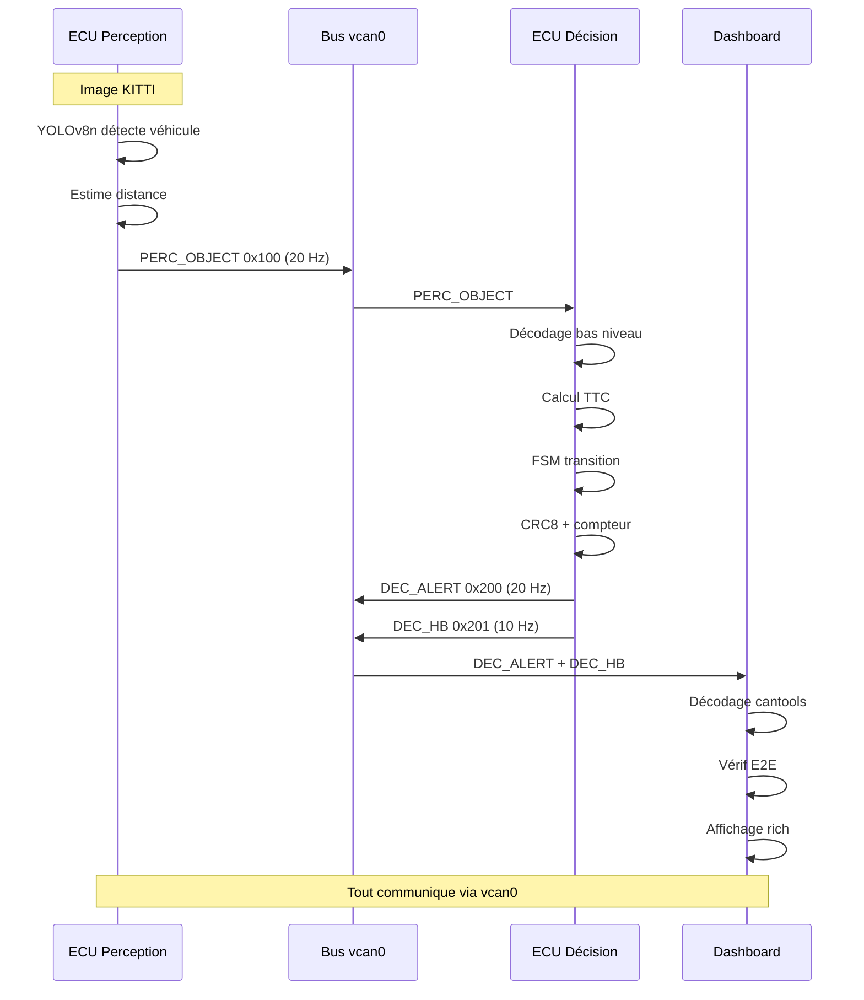

# Architecture du système ADAS FCW

## Vue d'ensemble

```mermaid
graph LR
    subgraph Perception["📷 ECU Perception (Python)"]
        YOLO[YOLOv8n<br/>Détection]
        DIST[Distance<br/>monoculaire]
        ENC1[Encodeur<br/>DBC]
        YOLO --> DIST --> ENC1
    end

    subgraph Bus["🚌 Bus CAN vcan0"]
        CAN((SocketCAN))
    end

    subgraph Decision["🧠 ECU Décision (C++)"]
        DEC[Decodeur<br/>PERC_OBJECT]
        TTC[Calcul<br/>TTC]
        FSM[FSM<br/>5 états]
        E2E[E2E<br/>CRC8 + counter]
        ENC2[Encodeur<br/>DEC_ALERT]
        DEC --> TTC --> FSM --> E2E --> ENC2
    end

    subgraph Dashboard["📊 Dashboard (Python)"]
        RX[Receiver<br/>SocketCAN]
        DEC2[Decodeur<br/>DEC_ALERT]
        UI[Affichage<br/>rich TUI]
        RX --> DEC2 --> UI
    end

    ENC1 -->|0x100<br/>PERC_OBJECT<br/>20 Hz| CAN
    CAN -->|0x100| DEC
    ENC2 -->|0x200<br/>DEC_ALERT<br/>20 Hz| CAN
    CAN -->|0x200| RX
    ENC2 -->|0x201<br/>DEC_HB<br/>10 Hz| CAN

    style Perception fill:#e1f5ff,stroke:#0288d1,stroke-width:2px
    style Decision fill:#fff4e1,stroke:#f57c00,stroke-width:2px
    style Dashboard fill:#e8f5e9,stroke:#388e3c,stroke-width:2px
    style Bus fill:#f3e5f5,stroke:#7b1fa2,stroke-width:2px
```

## Flux de données détaillé

```mermaid
sequenceDiagram
    participant P as ECU Perception
    participant CAN as Bus vcan0
    participant D as ECU Décision
    participant DB as Dashboard

    Note over P: Image KITTI
    P->>P: YOLOv8n détecte véhicule
    P->>P: Estime distance
    P->>CAN: PERC_OBJECT 0x100 (20 Hz)

    CAN->>D: PERC_OBJECT
    D->>D: Décodage bas niveau
    D->>D: Calcul TTC
    D->>D: FSM transition
    D->>D: CRC8 + compteur
    D->>CAN: DEC_ALERT 0x200 (20 Hz)
    D->>CAN: DEC_HB 0x201 (10 Hz)

    CAN->>DB: DEC_ALERT + DEC_HB
    DB->>DB: Décodage cantools
    DB->>DB: Vérif E2E
    DB->>DB: Affichage rich

    Note over P,DB: Tout communique via vcan0
```

